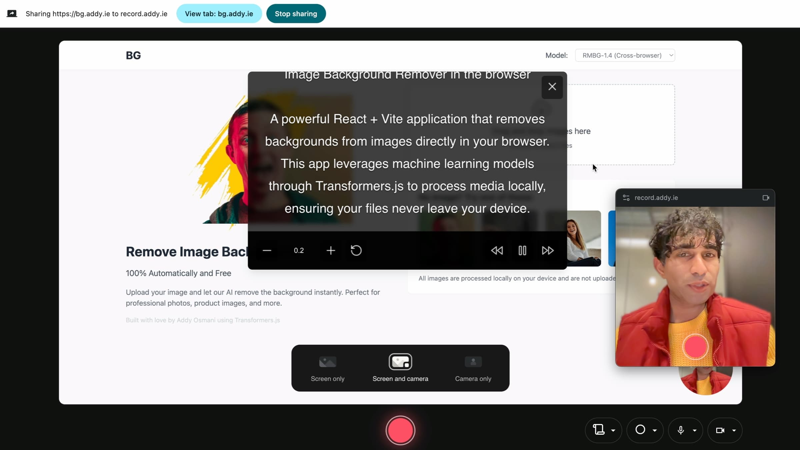
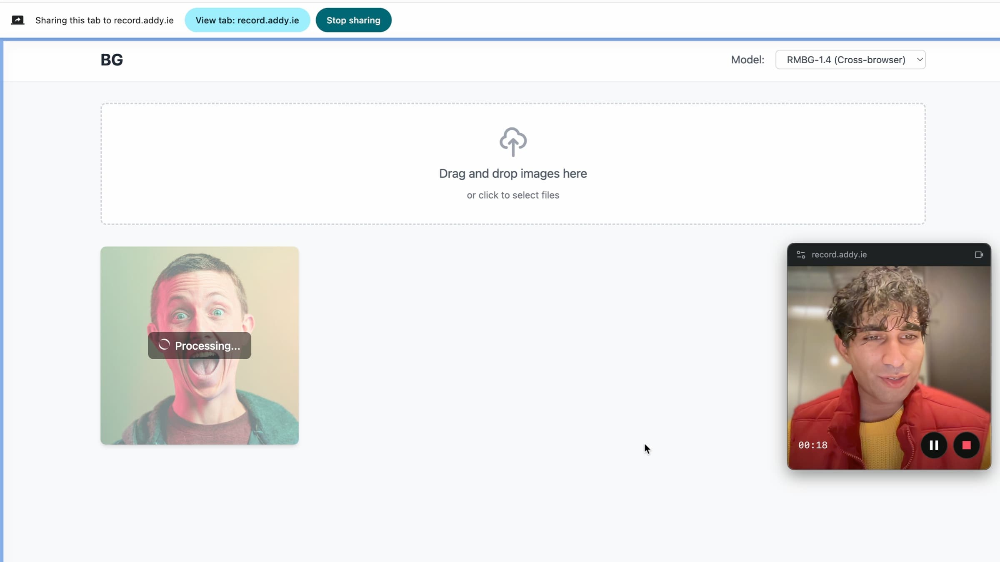

# 🎥 Record - AI-Powered Knowledge Management Platform

> **✅ PRODUCTION READY**: Complete full-stack Next.js SaaS platform with browser recording, AI-powered transcription, document generation, semantic search, and intelligent assistant!

Record is an open-source platform that combines browser-based screen recording with AI to automatically create searchable knowledge bases from your recordings.


<a align="center" href="https://record.addy.ie">
  
  
</a>

## Features (All 7 Phases Complete) ✅

### Recording (Original + Enhanced)
- ✨ **Browser-Based Recording:** No downloads required - record screen, camera, and audio directly in browser
- 🎥 **Multiple Modes:** Screen only, Screen + Camera, or Camera only
- 🖼️ **Picture-in-Picture:** Recording controls in a floating PiP window
- 🔄 **Camera Shapes:** Choose circle or square camera overlay
- 📝 **Teleprompter:** Built-in scrolling teleprompter with playback controls
- 🎬 **Real-time Preview:** See your recording before you start
- 🔄 **MP4 Conversion:** Convert WEBM to MP4 using FFMPEG.wasm

### Platform Features
- 🔐 **Authentication:** Secure sign-in with Clerk
- 👥 **Organizations:** Multi-tenant support with team collaboration
- ☁️ **Cloud Storage:** Automatic upload to Supabase Storage
- 📊 **Dashboard:** View and manage all your recordings
- 🎮 **Custom Player:** Feature-rich video playback with controls
- 🗄️ **Database:** PostgreSQL with pgvector for vector search

### AI-Powered Processing ✨
- 🎙️ **Auto-Transcription:** OpenAI Whisper speech-to-text with word-level timestamps
- 📄 **Document Generation:** GPT-5 Nano "Docify" creates structured markdown docs from transcripts
- 🧩 **Text Chunking:** Intelligent sentence-aware chunking with overlap
- 🔢 **Vector Embeddings:** OpenAI text-embedding-3-small embeddings for semantic search
- ⚙️ **Background Jobs:** Reliable async processing with retry logic
- 📦 **Batch Processing:** Efficient bulk embedding generation

### Search & Discovery ✨
- 🔍 **Semantic Search:** AI-powered vector similarity search across all recordings
- 🎯 **Hybrid Search:** Combines semantic understanding with keyword matching
- ⏱️ **Timestamp Navigation:** Jump directly to relevant moments in videos
- 🎨 **Result Highlighting:** Visual emphasis on matching content
- 🔎 **Advanced Filters:** Filter by source, date, recording, and more

### AI Assistant ✨ NEW
- 💬 **RAG-Powered Chat:** Ask questions about your recordings and get AI answers
- 📚 **Source Citations:** Every answer includes referenced sources with timestamps
- 🔄 **Streaming Responses:** Real-time token-by-token response generation
- 💭 **Conversation History:** Maintains context for follow-up questions
- 🎯 **Context-Aware:** Uses semantic search to find relevant information
- 🔗 **Clickable Sources:** Jump directly to exact moments in videos

### Sharing & Collaboration ✨ NEW
- 🔗 **Public Sharing:** Create shareable links for recordings
- 🔒 **Password Protection:** Secure shares with password + expiration
- 👁️ **View Tracking:** Track share views and limit access
- 👥 **Team Roles:** Owner, admin, contributor, and reader permissions

### Production Features ✨ NEW
- ⚡ **Rate Limiting:** Redis-backed sliding window algorithm prevents abuse
- 📊 **Monitoring:** Structured logging, error tracking, and performance metrics
- 🧪 **Testing:** Comprehensive Jest test suite with 70% coverage
- 🔐 **Security:** CSP, RBAC, input validation, security headers
- 🚀 **Performance:** Multi-layer caching, query optimization, recommended indexes
- 📚 **Deployment:** Complete Vercel deployment guide with all services

## Quick Start

### For End Users

**Try the Demo:** Visit [record.addy.ie](https://record.addy.ie) (coming soon with new features)

**Current Development Version:**

1. **Sign Up:** Create an account (Clerk authentication)
2. **Create Organization:** Set up your team workspace
3. **New Recording:**
   - Choose mode (screen, screen+camera, or camera only)
   - Select devices (camera, microphone)
   - Configure settings (camera shape, teleprompter)
   - Click Record → Grant browser permissions
   - Record your content
   - Stop → Automatic upload & processing
4. **View Recordings:**
   - Dashboard shows all recordings
   - Click to view with custom player
   - Processing status shows transcription/doc generation progress
5. **Share & Collaborate:** (Coming in Phase 6)

### For Developers

**Installation:**

```bash
# Clone repository
git clone https://github.com/yourusername/recorder.git
cd recorder

# Install dependencies
yarn install

# Set up environment
cp .env.example .env.local
# Fill in your API keys (Clerk, Supabase, OpenAI)

# Run database migrations
# (See QUICK_START.md for detailed instructions)

# Start development server
yarn dev

# Start background job worker (in separate terminal)
yarn worker
```

**Tech Stack:**
- Next.js 14, React 18, TypeScript
- Supabase (PostgreSQL + pgvector + Storage)
- Clerk (Authentication + Organizations)
- OpenAI (Whisper, GPT-5 Nano, text-embedding-3-small)
- Tailwind CSS + Material-UI

**Documentation:**
- [QUICK_START.md](QUICK_START.md) - Development setup guide
- [DEPLOYMENT.md](documentation/DEPLOYMENT.md) - Production deployment guide
- [IMPLEMENTATION_STATUS.md](IMPLEMENTATION_STATUS.md) - Development progress (100% complete!)
- [CLAUDE.md](CLAUDE.md) - Project overview for AI assistance
- [documentation/](documentation/) - Complete phase documentation (Phases 1-7)

## Browser Compatibility

Record currently only works with Chrome and Chromium browsers. It leverages certain browser capabilities that may not be available in other browsers at the moment.

## Support

If you encounter any issues, have questions, or need assistance, please feel free to [open an issue](https://github.com/addyosmani/recorder/issues) on GitHub. We welcome your feedback and are happy to assist with any questions or concerns you may have.

## Development & Contributions

Excited to dive into the code and make this app even cooler? To get started, follow these steps:

1. **Clone the Repository:** Fork the Record repository and clone it to your local machine using Git.

   ```bash
   git clone https://github.com/addyosmani/recorder.git
   ```

2. **Navigate to the Directory:** Move into the Record project directory.

   ```bash
   cd recorder
   ```

3. **Install Dependencies:** Install the necessary dependencies using Yarn.

   ```bash
   yarn
   ```

4. **Run the Development Server:** Start the development server with Yarn.

   ```bash
   yarn dev
   ```

5. **Make Your Changes:** Work your magic! Make the desired improvements, add features, or fix issues.

6. **Create a Pull Request:** Once you're happy with your changes, create a pull request on the main Record repository. We'll review your contribution and merge it if everything looks good!

## Credits

This project is a fork of the original [Recorder](https://github.com/contrastio/recorder) by [Contrast](https://getcontrast.io). This fork adds a number of features across camera layout, teleprompting, MP4 conversion and others.

## License

Recorder is released under the [MIT License](LICENSE), allowing you to freely use, modify, and distribute the application.

<br/>

---

<br/>

Time to unleash your creativity and capture those moments with Recorder! 🎬🌟 Lights, camera, action!
